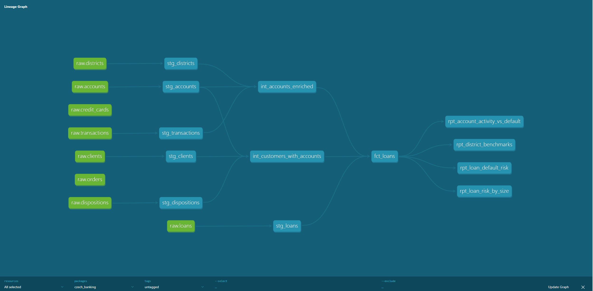

# Czech Banking Analytics — dbt + BigQuery

An end-to-end analytics engineering project modelling a real anonymised 
Czech bank dataset using dbt Core and BigQuery, focused on **loan default 
risk analysis** across customer, account, and regional dimensions.


---

## The Business Problem

A Czech bank wants to understand what drives loan defaults. 
This project answers 4 core risk questions using 1M+ real anonymised 
transactions from 1993-1998:

| # | Question | Model |
|---|----------|-------|
| Q1 | What customer and account characteristics are most associated with loan default? | `rpt_loan_default_risk` |
| Q2 | Do high-activity accounts default less on loans? | `rpt_account_activity_vs_default` |
| Q3 | Which districts have the highest default rates, and does local unemployment explain it? | `rpt_district_benchmarks` |
| Q4 | Is there a loan amount or duration threshold above which default risk increases? | `rpt_loan_risk_by_size` |

---

## Stack

- **Warehouse:** Google BigQuery (free tier)
- **Transformation:** dbt Core 1.11
- **Ingestion:** Python (pandas + google-cloud-bigquery)
- **Version Control:** GitHub (branching strategy: dev → main)
- **Language:** SQL (BigQuery dialect)

---

## Dataset

**Czech Banking Dataset (PKDD'99 / Berka Dataset)**
- Source: [Kaggle](https://www.kaggle.com/datasets/marceloventura/the-berka-dataset)
- Real anonymised data from a Czech bank (1993–1998)
- 8 related tables, 1M+ transactions

| Table | Rows | Description |
|-------|------|-------------|
| transactions | 1,056,320 | Every debit/credit on every account |
| accounts | 4,500 | Account metadata |
| clients | 5,369 | Customer demographics |
| dispositions | 5,369 | Links clients to accounts |
| loans | 682 | Loan amounts, durations, status |
| credit_cards | 892 | Card types per account |
| orders | 6,471 | Standing payment orders |
| districts | 77 | Regional demographics |

---

## Project Structure

```
models/
├── staging/          
│   ├── stg_transactions.sql
│   ├── stg_accounts.sql
│   ├── stg_clients.sql
│   ├── stg_loans.sql
│   ├── stg_districts.sql
│   ├── stg_dispositions.sql
│   └── _sources.yml
├── intermediate/     
│   ├── int_accounts_enriched.sql
│   └── int_customers_with_accounts.sql
└── marts/
    └── risk/         
        ├── fct_loans.sql
        ├── rpt_loan_default_risk.sql
        ├── rpt_account_activity_vs_default.sql
        ├── rpt_district_benchmarks.sql
        └── rpt_loan_risk_by_size.sql
```
---

## Lineage Graph



---

## Key Findings

**Q1 — Who defaults?**
**Q1 — Who defaults?**
- West Bohemia has the highest default rate at 29.4% however, this is based on only 17 loans so treat as directional rather than conclusive.
- North Moravia is the most reliable high-risk region with meaningful sample sizes, having Bruntal (6 loans, 50% default) and Opava (9 loans, 33% default) consistently appear at the top.
- Female customers in inactive (finished) loans show higher default rates than male customers in the same category. Worth noting, sample sizes are small and this should be interpreted with caution.
- Average customer age at loan date is 38 for both defaulters and non-defaulters, resulting in age not being a differentiator in this dataset.
- All high-default districts have average salaries between 8,100-9,650 CZK, lower salary districts cluster at the top regardless of gender.

**Q2 — Does account activity predict default?**
- Defaulters have slightly more transactions on average (299 vs 281), being active on your account does not protect you from default.
- The strongest differentiator is average monthly balance. Defaulters average 35,166 CZK vs 46,004 CZK for non-defaulters. Lower financial cushion appears more predictive than transaction volume.
- Defaulters borrowed significantly more on average (205k vs 146k CZK), making loan size a stronger predictor than account activity.
- Account activity alone is NOT a reliable predictor of default. The data suggests that what you borrow matters more than how you bank.

**Q3 — Which districts are riskiest?**
- North Moravia is the most consistently high-risk region. Note that, Bruntal and Opava 
  appear in the top 10 with sample sizes large enough to be meaningful (6-9 loans)
- Higher unemployment does correlate with higher default rates but it is not 
  the sole driver. For example, Sokolov (50% default rate) has lower unemployment than 
  Bruntal (also 50%) suggesting other local factors are at play.
- Districts with both high unemployment and low average salary cluster at the 
  top, are the best combination of both indicators that best explains regional risk.
- Prague is an outlier, with very low unemployment (0.29%) but still 14.3% default 
  rate, suggesting urban risk factors differ from rural ones.

**Q4 — Does loan size drive default?**
- This is the clearest and most consistent finding in the project, large loans 
  (over 200k CZK) have a 22% default rate compared to just 7.1% for small loans 
  (under 100k CZK). This pattern holds across all duration buckets.
- Duration alone does not predict default. 36 months appears in both the 
  highest risk group (22% for large loans) and lower risk groups (5.5% for 
  small loans). It is the combination of large amount + 36 month duration 
  that carries the most risk.
- 200k CZK emerges as a meaningful risk threshold as loans above this amount 
  are significantly more likely to default regardless of duration
- Small loans (under 100k) at 60 months show 0% default rate, suggesting 
  longer durations are manageable when the loan amount is small.

---

## Design Decisions

**Three-layer architecture**
Staging models only clean and rename, no business logic. Intermediate 
models handle joins. Marts are the analytics-ready outputs. This means 
source changes only require updating one staging model.

**Incremental materialisation for fct_transactions**
Not built in this version but the pattern is established. With 1M+ rows 
a full refresh on every run would be expensive in BigQuery.

**Mart models materialised as tables**
Report models are materialised as tables rather than views so downstream 
queries are fast and don't re-scan the full transaction history.

**Age calculated at loan date**
Customer age is calculated as of the loan date, not today. This dataset 
is from 1993-1998 so using current_date() would give misleading ages 
(60-70 year olds instead of 30-40 year olds).

**OWNER filter in int_customers_with_accounts**
One account can have multiple clients (owner + disponent). Without 
filtering to OWNER only, fct_loans had 145 duplicate loan_id rows. 
Caught by a dbt unique test and fixed at the intermediate layer.

---

## Testing

13 tests across all mart models:
- `unique` and `not_null` on all primary keys
- `accepted_values` on loan_status (A/B/C/D)
- `not_null` on key metrics in all report models

Run tests:
```bash
dbt test
```

---

## How to Run

**Prerequisites**
- Google Cloud account with BigQuery enabled
- Python 3.12+
- dbt-bigquery installed

**1 — Clone the repo**
```bash
git clone https://github.com/Joanajjo/czech_banking_analysis.git
cd czech_banking_analysis
```

**2 — Set up virtual environment**
```bash
python -m venv dbt-env
dbt-env\Scripts\activate  # Windows
pip install dbt-bigquery
```

**3 — Configure profiles.yml**
Create `~/.dbt/profiles.yml`:
```yaml
czech_banking:
  target: dev
  outputs:
    dev:
      type: bigquery
      method: oauth
      project: YOUR_PROJECT_ID
      dataset: dbt_dev
      threads: 4
      location: EU
```

**4 — Authenticate**
```bash
gcloud auth application-default login
```

**5 — Load raw data**
Download the Berka dataset from Kaggle and run:
```bash
python load_to_bq.py
```

**6 — Run dbt**
```bash
dbt deps
dbt build
```

---

## What I Would Add Next

- **GitHub Actions CI** — run `dbt test` on every pull request
- **fct_transactions** — incremental fact table for transaction-level 
  analysis beyond loan risk
- **Cohort analysis** — track account activity by opening quarter
- **dbt Exposures** — document which report models feed into which 
  dashboards
- **Data freshness tests** — `dbt source freshness` to monitor 
  pipeline health

---

## Interesting Data Challenges

- **Date encoding** — all dates stored as YYMMDD integers (e.g. 930705 = 1993-07-05). Decoded in staging using `parse_date`
- **Birth number encoding** — gender and date of birth encoded in a single integer. Female clients have 50 added to the month component. Decoded in `stg_clients`
- **Duplicate loans** — one account can have multiple clients (OWNER + DISPONENT). Caused 145 duplicate loan_id rows in fct_loans. Fixed by filtering to OWNER only in `int_customers_with_accounts`. Caught by dbt unique test.
- **String columns** — unemployment_rate_95 and crime_rate_95 loaded as strings from source. Cast to FLOAT64 in staging using `safe_cast`

---

## Dashboard

🚧 Power BI dashboard in progress — link coming soon.

The dashboard will visualise the 4 key risk findings directly from 
the BigQuery mart models:
- Loan default rates by region and gender
- Account activity vs default comparison  
- District benchmarks with economic indicators
- Loan size and duration risk buckets

---

## Author

Built as a portfolio project targeting analytics engineering roles 
at fintech companies.